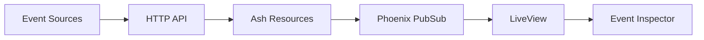

# Event Inspector 🔍

*Real-time event monitoring and inspection for the Athena ecosystem*

## Overview

The Event Inspector transforms raw event data into actionable insights through an elegant, professional interface. Built with Phoenix LiveView, it provides millisecond-fast updates, intelligent categorization, and deep inspection capabilities that make understanding your system's behavior effortless.

**Why Event Inspector?**
- **Zero Latency**: See events the moment they happen, not when you refresh
- **Intelligent Design**: Color-coded types, structured metadata, and intuitive navigation
- **Production Ready**: Handles high-frequency events with grace and performance
- **Developer Focused**: Rich debugging information and raw data access

## Core Capabilities

### ⚡ Real-time Event Stream
Watch your system breathe with live event updates powered by Phoenix PubSub. No more stale dashboards or constant refreshing - events appear instantly as they're generated across your infrastructure.

- **Sub-second latency** from event creation to visualization
- **Automatic reconnection** handles network interruptions gracefully  
- **Live status indicators** show connection health and last update time

### 🎯 Master-Detail Interface
A thoughtfully designed split-panel layout that scales from a single event to thousands. The left panel provides rapid scanning while the right panel offers deep inspection.

- **Rapid event scanning** with visual previews and metadata hints
- **One-click inspection** reveals complete event structure
- **Keyboard navigation** for power users (arrow keys, escape to clear)
- **Responsive layout** adapts to different screen sizes

### 🌈 Intelligent Categorization
Events are automatically categorized using namespace-based rules, with visual color coding that makes patterns instantly recognizable.

- **Namespace-aware coloring** (e.g., `user.*` = blue, `system.*` = purple)
- **Event type aggregation** shows activity patterns at a glance
- **Smart filtering** highlights the most active event types

### 🔬 Deep Event Inspection
Every event tells a story. The inspector reveals not just what happened, but the complete context around it.

- **Structured metadata rendering** with syntax highlighting
- **Nested object exploration** for complex event payloads
- **Raw JSON access** for debugging and API development
- **System audit trail** showing creation and modification timestamps

## Visual Event Classification

Events are automatically color-coded based on their namespace, creating visual patterns that help you understand system behavior at a glance:

| Color | Namespace | Purpose | Examples |
|-------|-----------|---------|----------|
| 🟣 **Purple** | `system.*` | Infrastructure & discovery | `system.event_type_discovered` |
| 🔵 **Blue** | `user.*` | User interactions | `user.login_success`, `user.profile_updated` |
| 🟢 **Green** | `collector.*` | Data collection | `collector.file_scan_complete` |
| 🟡 **Yellow** | `analytics.*` | Behavioral tracking | `analytics.page_view`, `analytics.conversion` |
| 🔴 **Red** | `monitoring.*` | Health & performance | `monitoring.cpu_high`, `monitoring.disk_full` |
| 🟢 **Emerald** | `payment.*` | Financial events | `payment.transaction_complete` |
| 🟠 **Orange** | `security.*` | Security events | `security.login_attempt`, `security.breach_detected` |
| ⚪ **Gray** | *other* | Legacy or uncategorized | `file_collector_startup` |

**Why Color Coding Matters:**
- **Pattern Recognition**: Spot unusual activity patterns instantly
- **Visual Debugging**: Identify event flow issues without reading details
- **Quick Filtering**: Mentally filter event types during investigation

## Quick Start

### 1. Launch the Inspector
Navigate to `http://localhost:4000/events` in your browser.

### 2. Generate Test Events
```bash
# Create a test event to see the interface in action
curl -X POST http://localhost:4000/webhook/test \
  -H "Content-Type: application/json" \
  -d '{
    "id": "demo-event",
    "timestamp": "'$(date -u +"%Y-%m-%dT%H:%M:%S.000Z")'",
    "type": "user.demo_action",
    "source": "demo_app",
    "metadata": {"demo": true},
    "description": "This is a demonstration event"
  }'
```

### 3. Explore the Interface
- **Select Events**: Click on any event in the left panel
- **View Details**: Explore metadata, raw JSON, and system info
- **Watch Live**: New events appear automatically as they're created
- **Clear Selection**: Use the "✕ Clear" button or click elsewhere

## Interface Guide

| Element | Purpose | Location |
|---------|---------|----------|
| **Status Header** | System health, event count, last update | Top bar |
| **Event Feed** | Chronological list with previews | Left panel |
| **Type Summary** | Active event types with counts | Below header |
| **Details View** | Complete event inspection | Right panel |
| **Action Controls** | Refresh, clear selection | Top right |

## Event Schema

```elixir
%Event{
  id: "uuid-v4",                    # Unique identifier
  timestamp: ~U[2025-06-09 03:14:34.000Z],  # When event occurred
  event_type: "user.login_success", # Namespaced event type
  source_id: "web_app",             # Event source system
  confidence: 0.95,                 # Optional: confidence score (0.0-1.0)
  description: "User logged in",    # Human-readable summary
  metadata: %{},                    # Flexible key-value payload
  validation_errors: nil,           # Any schema validation issues
  created_at: ~U[...],             # System creation time
  updated_at: ~U[...]              # System modification time
}
```

**Key Design Decisions:**
- **Flexible metadata**: No rigid schema - adapt to any event type
- **Confidence scoring**: ML-generated events can indicate certainty
- **Namespace routing**: Event types determine processing and visualization
- **Audit trail**: Created/updated timestamps track system changes

## Auto-Discovery System

When a new event type is encountered, the system automatically creates a `system.event_type_discovered` event. This provides:

- **Ecosystem visibility**: Track new integrations and data sources
- **Change detection**: Know when your system evolves
- **Recursion protection**: System events don't trigger more system events
- **Rich metadata**: Includes discovery timestamp and source information

## Performance Characteristics

- **Sub-100ms latency**: Phoenix PubSub delivers events instantly
- **Memory bounded**: Interface shows 20 most recent events
- **Connection resilient**: Automatic reconnection on network issues
- **Burst tolerant**: Handles rapid event creation without blocking

## Integration Points



The Event Inspector sits at the end of a robust event pipeline that can accept events from any HTTP-capable source.

---

*For technical implementation details, see [ARCHITECTURE.md](./ARCHITECTURE.md)*  
*For API integration, see [API.md](./API.md)*