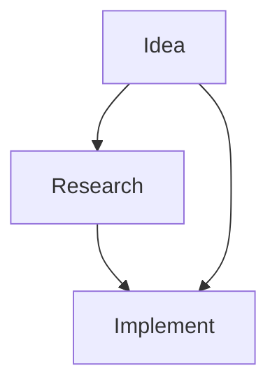

# Force-Directed Charts in Markdown: 2025 Guide

*Research Date: 2025-06-11*

## 🎯 Quick Start (Easiest Method)

```html
<div id="graph" style="width: 600px; height: 400px;"></div>
<script src="https://cdn.jsdelivr.net/npm/force-graph"></script>
<script>
const data = {
  nodes: [
    { id: "concept1", name: "Zero-Touch" },
    { id: "concept2", name: "AIX" },
    { id: "concept3", name: "Collaboration" }
  ],
  links: [
    { source: "concept1", target: "concept2" },
    { source: "concept2", target: "concept3" }
  ]
};

ForceGraph()(document.getElementById('graph'))
  .graphData(data)
  .nodeLabel('name');
</script>
```

**Works in**: GitHub Pages, Jekyll, Hugo, any static site → **so that** you can visualize immediately

## 🏆 Top 5 Solutions Ranked by Ease

### 1. force-graph (Winner for Simplicity)
- **Setup Time**: 2 minutes
- **CDN**: `https://cdn.jsdelivr.net/npm/force-graph`
- **AIX Score**: 10/10 - Just works
- **Best For**: Quick concept maps, relationship diagrams

### 2. Vis.js Network
- **Setup Time**: 5 minutes  
- **CDN**: `https://unpkg.com/vis-network/standalone/umd/vis-network.min.js`
- **AIX Score**: 9/10 - Great docs, smooth interaction
- **Best For**: Large networks (1000+ nodes)

### 3. Mermaid.js
- **Setup Time**: 0 minutes (native in GitHub)
- **AIX Score**: 8/10 - Limited to simple layouts
- **Best For**: Documentation diagrams


### 4. D3.js Force
- **Setup Time**: 30+ minutes
- **CDN**: `https://d3js.org/d3.v7.min.js`
- **AIX Score**: 5/10 - Powerful but complex
- **Best For**: Custom visualizations

### 5. Cytoscape.js
- **Setup Time**: 15 minutes
- **AIX Score**: 7/10 - Scientific focus
- **Best For**: Biological/scientific networks

## 📦 Copy-Paste Templates

### Template 1: Concept Relationship Graph
```html
<!-- Paste this directly in your markdown -->
<div id="concepts" style="width: 100%; height: 500px;"></div>
<script src="https://cdn.jsdelivr.net/npm/force-graph"></script>
<script>
// Your glossary concepts as nodes
const concepts = {
  nodes: [
    { id: 1, name: "Zero-Touch", group: 1 },
    { id: 2, name: "Sidequest", group: 2 },
    { id: 3, name: "AIX", group: 1 },
    { id: 4, name: "Reflection Protocol", group: 2 }
  ],
  links: [
    { source: 1, target: 3, value: 2 },
    { source: 2, target: 4, value: 1 }
  ]
};

const Graph = ForceGraph()
  (document.getElementById('concepts'))
  .graphData(concepts)
  .nodeAutoColorBy('group')
  .nodeLabel('name')
  .linkDirectionalArrowLength(6);
</script>
```

### Template 2: Interactive Network (Vis.js)
```html
<div id="network" style="width: 100%; height: 500px;"></div>
<script src="https://unpkg.com/vis-network/standalone/umd/vis-network.min.js"></script>
<script>
const nodes = new vis.DataSet([
  { id: 1, label: 'Node 1' },
  { id: 2, label: 'Node 2' }
]);
const edges = new vis.DataSet([
  { from: 1, to: 2 }
]);
const container = document.getElementById('network');
const data = { nodes: nodes, edges: edges };
const options = {};
const network = new vis.Network(container, data, options);
</script>
```

## 🚀 Integration by Platform

### GitHub Pages / Jekyll
1. Add to `_includes/force-graph.html`
2. Include in posts: ``

### Hugo  
1. Create shortcode: `layouts/shortcodes/forcegraph.html`
2. Use in content: ``

### Plain Markdown
Just paste the HTML/Script blocks directly!

## 💡 AIX Tips

1. **Start Simple**: Use force-graph with CDN first
2. **Test Locally**: Open HTML file directly in browser
3. **Data Format**: Keep nodes/links structure consistent
4. **Responsive**: Set width: 100% for mobile
5. **Fallback**: Include static image for RSS/email

## 🔗 Resources

- [force-graph docs](https://github.com/vasturiano/force-graph)
- [Vis.js examples](https://visjs.github.io/vis-network/examples/)
- [Observable notebooks](https://observablehq.com/@d3/force-directed-graph) for prototyping

---

*Next: Create glossary visualization using force-graph*